<p align="center">
  
</p>

<h1 align="center">🚨 Alertify: Voice-Activated Emergency Alert System 🚨</h1>

<p align="center">
  <b>Instant, hands-free emergency alerts with voice, location, and SMS.</b><br>
  <i>Empowering safety for everyone, everywhere.</i>
</p>

---

Alertify is a robust, Python-powered emergency alert platform designed for instant, accessible, and reliable crisis communication. Leveraging voice commands, real-time location sharing, and SMS notifications, Alertify ensures that help is always just a voice command away.

---

## 📑 Table of Contents
1. [Project Overview](#project-overview)
2. [Key Features](#key-features)
3. [System Architecture](#system-architecture)
4. [File & Directory Structure](#file--directory-structure)
5. [Setup & Installation](#setup--installation)
6. [Configuration](#configuration)
7. [How to Use](#how-to-use)
8. [Screenshots](#screenshots)
9. [Security & Privacy](#security--privacy)
10. [Customization](#customization)
11. [Contributing](#contributing)
12. [Credits](#credits)

---

## 📝 Project Overview

Alertify empowers users to:
- 🎤 Trigger emergency alerts using only their voice.
- 📍 Instantly notify trusted contacts via SMS, including the user’s real-time location.
- 👥 Manage emergency contacts and user accounts through a secure web interface.
- 👐 Operate hands-free, making it accessible for all, especially in situations where manual interaction is not possible.

---

## ✨ Key Features
- 🎙️ <b>Voice-activated emergency alerts:</b> Initiate help requests using speech recognition.
- 🌐 <b>Real-time location sharing:</b> Automatically appends accurate GPS coordinates and a Google Maps link to outgoing alerts.
- 👤 <b>Multi-user support:</b> Register, log in, and securely manage personal emergency contacts.
- 📞 <b>Contact management:</b> Add, update, or remove recipients for emergency notifications.
- 💻 <b>Web-based interface:</b> Clean, user-friendly HTML templates for all user interactions.
- 📲 <b>Twilio SMS integration:</b> Reliable, scalable delivery of emergency messages.

---

## 🏗️ System Architecture

- <b>server.py</b>: Handles voice input, location retrieval, and the core SMS alert logic.
- <b>server2.py</b>: Manages user authentication, registration, contact management, and web endpoints.
- <b>JSON Storage</b>: <code>users.json</code> and <code>phone_numbers.json</code> store persistent user and contact data.
- <b>HTML Templates</b>: Reside in the <code>templates/</code> folder for web UI rendering.

⚠️ <b>Both servers must be run concurrently for the complete system to function.</b>

---

## 🗂️ File & Directory Structure

```text
ALERTIFY
├── server.py                # Emergency logic: voice, location, SMS
├── server2.py               # User & contact management, web endpoints
├── phone_numbers.json       # Emergency contact storage
├── users.json               # User credentials storage
├── templates/               # HTML templates
│   ├── index.html
│   ├── index2.html
│   ├── main.html
│   └── signin.html
├── .gitignore
└── README.md
```

---

## ⚙️ Setup & Installation

### 🛠️ Prerequisites
- Python 3.x
- pip (Python package manager)
- Twilio account (for SMS functionality)

### 📦 Install Dependencies
Run the following in your project directory:
```bash
pip install flask pyttsx3 requests twilio SpeechRecognition
```

---

## 🛡️ Configuration

1. <b>Twilio Credentials</b>:
   - Open <code>server.py</code> and <code>server2.py</code>.
   - Enter your Twilio Account SID and Auth Token:
     ```python
     account_sid = 'YOUR_TWILIO_SID'
     auth_token = 'YOUR_TWILIO_AUTH_TOKEN'
     ```
2. <b>Secret Key</b>:
   - In <code>server2.py</code>, set a secure value for <code>app.secret_key</code>.

---

## 🚀 How to Use

1. <b>Start the Servers</b>
   - Open two terminals in your project directory:
     ```bash
     python server.py
     ```
     ```bash
     python server2.py
     ```
2. <b>Access the Web Interface</b>
   - Open your browser to <code>http://127.0.0.1:5000</code> or <code>http://127.0.0.1:5001</code>.
3. <b>Register & Log In</b>
   - Create a user account and log in.
4. <b>Add Emergency Contacts</b>
   - Use the web UI to register phone numbers of trusted contacts.
5. <b>Trigger an Emergency Alert</b>
   - Use the voice interface (microphone required) to activate an emergency alert. The system will recognize your command, fetch your location, and send an SMS to all registered contacts.

---

## 🔧 System Output Screenshots

### 🗣️ Voice Command Trigger
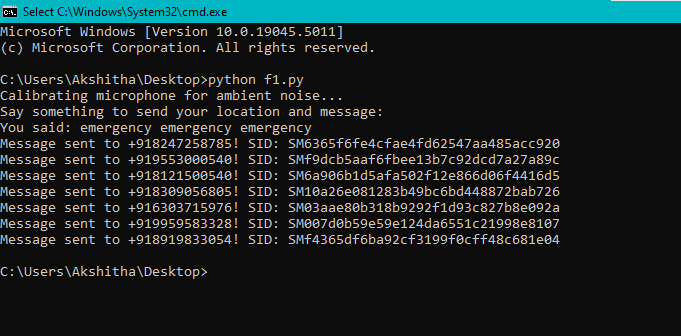

### 📍 Location Sent via SMS
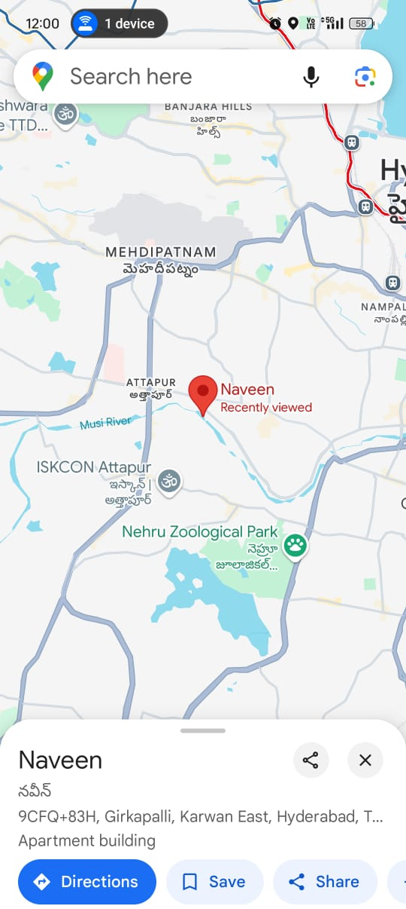
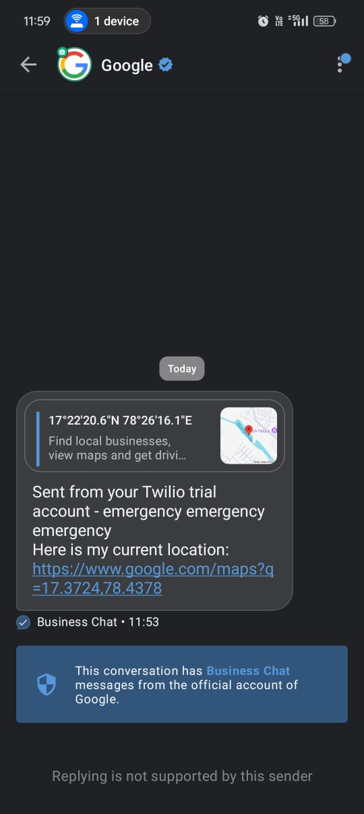
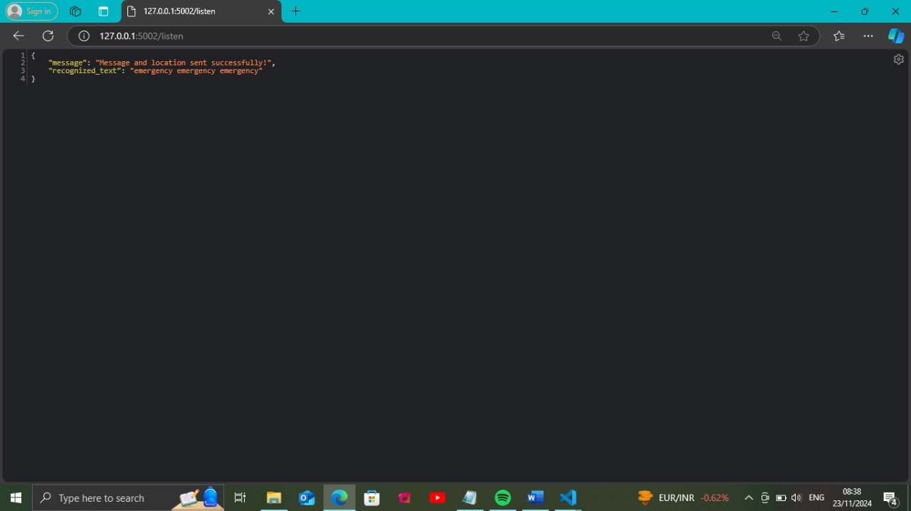

### 🌐 Map Screenshot


### 📱 Messages Sent
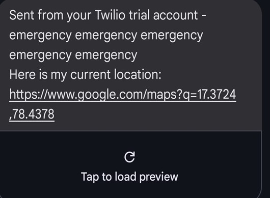
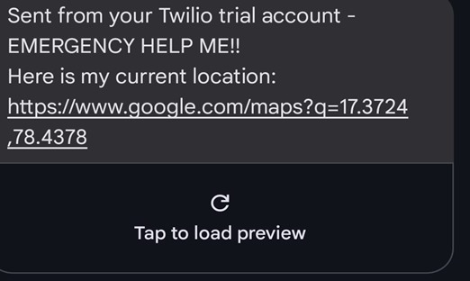


### 🧪 System Output
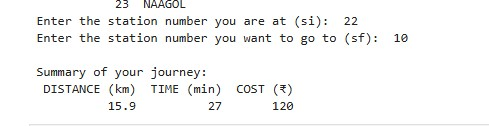
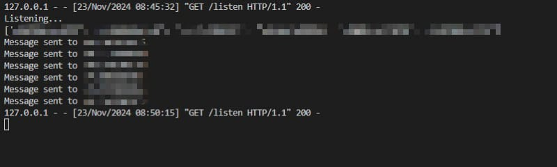

### 📝 User Pages
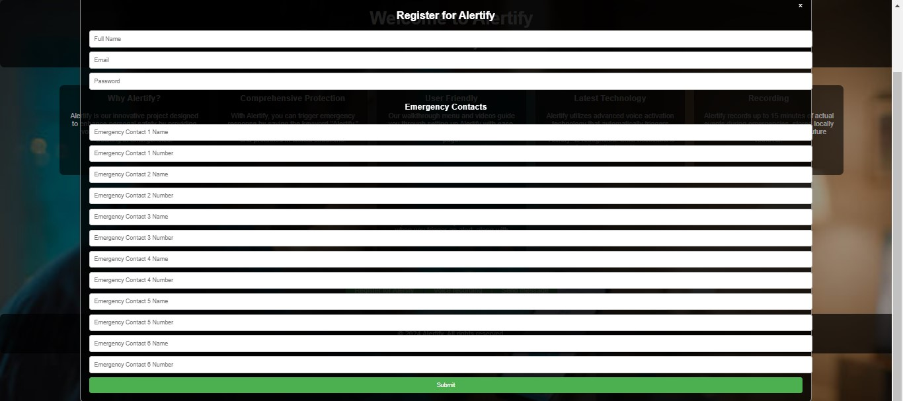
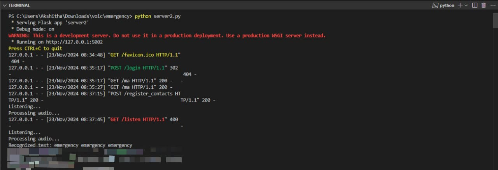
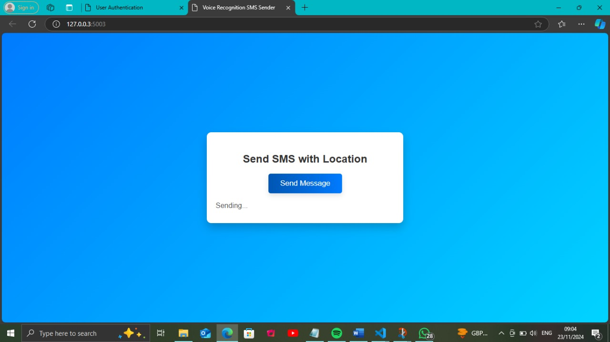
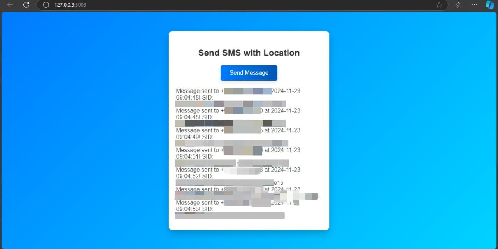
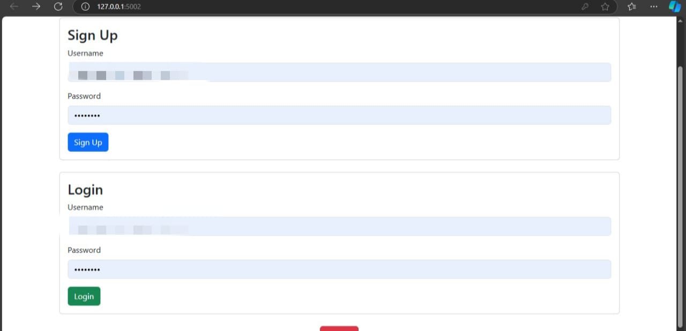

### 🏠 Main UI


---

## 🔒 Security & Privacy
- 🔑 <b>Credentials</b>: Never commit real Twilio credentials or secret keys to public repositories.
- 💾 <b>Data Storage</b>: User and contact data are stored in local JSON files. For production, use a secure database and environment variables for secrets.
- 🕵️ <b>User Privacy</b>: Location and contact data are only used for emergency alerts and never shared with third parties.

---

## 🛠️ Customization
- 🎨 Enhance the UI in <code>templates/</code> for improved user experience.
- 📧 Add new notification channels (email, push, etc.).
- 🗺️ Integrate with additional APIs for richer location or alerting features.
- 🛡️ Expand user roles or add admin dashboards as needed.

---

## 🤝 Contributing

```bash
# 🍴 Fork this repository on GitHub
# 🌱 Create a new branch for your feature
 git checkout -b feature/YourFeature
# 💾 Commit your changes
 git commit -am 'Add new feature'
# 🚀 Push to the branch
 git push origin feature/YourFeature
# 📝 Open a Pull Request via GitHub interface
```

---

<p align="center">
  <b>For any questions or feedback, feel free to raise an issue or contribute!</b>
</p>
